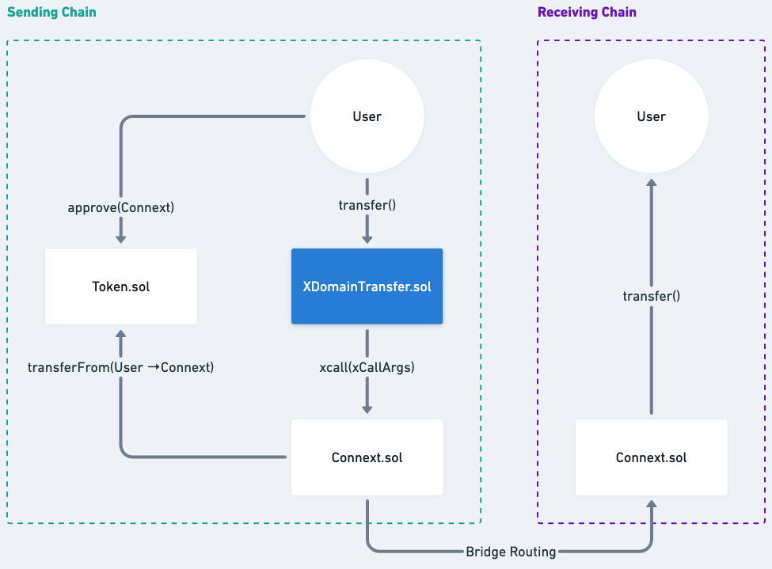
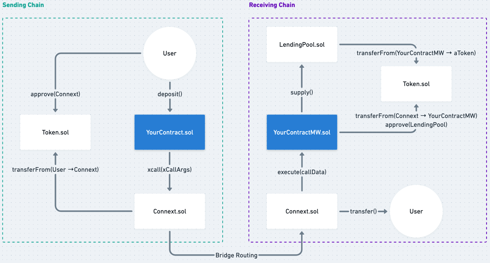

# xapp-starter

Starter kit for cross-domain apps (xApps).
# Overview

With Connext's upgraded protocol, there are generally three types of bridging transactions.
- Simple transfers
- Permissionless calls
- Permissioned calls

This starter repo contains contracts that demonstrate how to use each type of transaction.

## XDomainTransfer

Simple transfer from Sending Chain to Receiving Chain. Does not use calldata.

Contracts:
- XDomainTransfer.sol


## XDomainDeposit

Deposit funds from Sending Chain into an Aave V3 Pool on the Receiving Chain. Uses permissionless call on the receiving side.

Contracts:
- XDomainDeposit.sol


## XDomainGovern


Permissioned call on the receiving side.

Contracts:
- XDomainGovern.sol
# Development

## Getting Started

This project uses Foundry for testing smart contracts and Hardhat for deploying them.

- See the official Foundry installation [instructions](https://github.com/gakonst/foundry/blob/master/README.md#installation).
- [Forge template](https://github.com/abigger87/femplate) by abigger87.

## Blueprint

```ml
src
├─ tests
│  └─ unit 
│     └─ XDomainTransfer.t.sol — "XDomainTransfer Unit Tests"
│     └─ XDomainDeposit.t.sol — "XDomainDeposit Unit Tests"
│  └─ integration
|     └─ XDomainTransferForked.t.sol — "XDomainTransfer Integration Tests"
|     └─ XDomainDepositForked.t.sol — "XDomainDeposit Integration Tests"
└─ XDomainTransfer.sol — "An XDomainTransfer Contract"
└─ XDomainDeposit.sol — "An XDomainDeposit Contract"
```
## Setup
```bash
make
```

> If you are using an M1 mac, follow the instructions for installing Nix and dapptools [here](https://github.com/dapphub/dapptools). Double check that `/etc/nix/nix.conf` contains `system = x86_64-darwin`.
>
> During `make`, you may run into this error message: 
> ```
> error: file 'REPEAT' was not found in the Nix search path (add it using $NIX_PATH or -I)
> ```
>
> This GitHub issue [comment](https://github.com/NixOS/nixpkgs/issues/163374#issuecomment-1062480297) should help.

## Testing

### Unit Tests

```bash
make test-unit
```

### Integration Tests

This uses forge's `--forked` mode. Make sure you have `TESTNET_RPC_URL` defined in your `.env` file.
```
make test-forked
```

### Deployment & Verification

Inside the [`scripts/`](./scripts/) directory are a few preconfigured scripts that can be used to deploy and verify contracts.

Scripts take inputs from the cli, using silent mode to hide any sensitive information.

NOTE: These scripts are required to be _executable_ meaning they must be made executable by running `chmod +x ./scripts/*`.

NOTE: For local deployment, make sure to run `yarn` or `npm install` before running the `deploy_local.sh` script. Otherwise, hardhat will error due to missing dependencies.

NOTE: these scripts will prompt you for the contract name and deployed addresses (when verifying). Also, they use the `-i` flag on `forge` to ask for your private key for deployment. This uses silent mode which keeps your private key from being printed to the console (and visible in logs).
