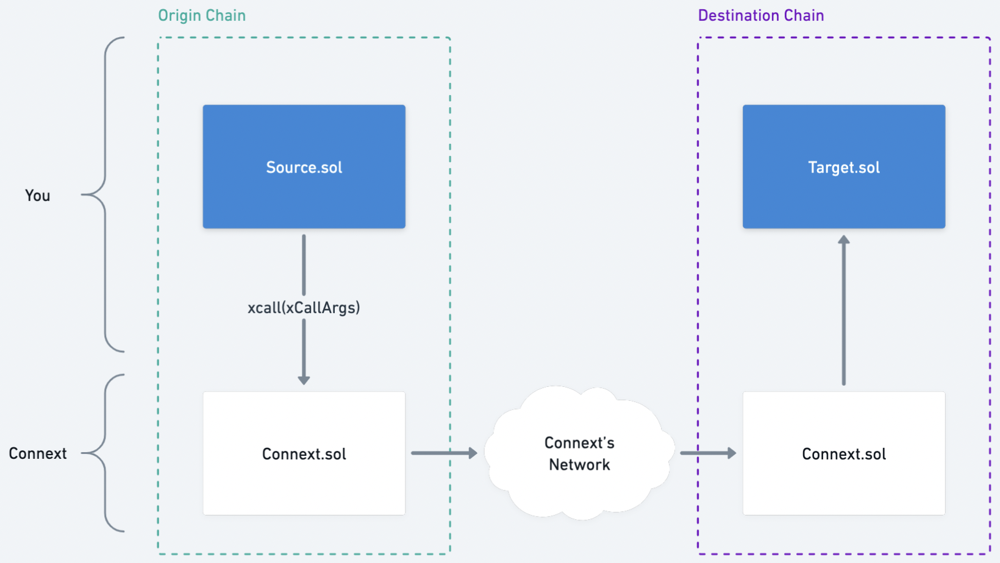

# xapp-starter

Starter kit for cross-domain apps (xApps).
# Overview

With Connext's upgraded protocol, there are generally three types of bridging transactions that can be executed fully through smart contract integration.
- Simple transfers
- Permissionless calls
- Permissioned calls

This starter repo contains contracts that demonstrate how to use each type of transaction.



## XDomainTransfer

Simple transfer from Sending Chain to Receiving Chain. Does not use calldata. 

Example use cases:
- Send funds across chains

Contracts:
- XDomainTransfer.sol

## XDomainPermissionless

Transfer funds and/or call a target contract with arbitrary calldata on the Receiving Chain. Assuming the receiving side is a permissionless call, this flow is essentially the same as a simple transfer except encoded calldata is included in the `xcall`. The call can simply use `amount: 0` if no transfer is required.

Example use cases:
- Deposit funds into a liquidity pool on the Receiving Chain
- Execute a token Swap on the Receiving Chain

Contracts:
- XDomainPermissionless.sol
- PermissionlessTarget.sol

## XDomainPermissioned

Like permissionless, call a target contract with arbitrary calldata on the Receiving Chain. Except, the target function is permissioned which means the contract owner must make sure to check the origin in order to uphold permissioning requirements.

Example use cases:
- Hold a governance vote on Sending Chain and execute the outcome of it on the Receiving Chain (and other DAO operations)
- Lock-and-mint or burn-and-mint token bridging
- Connecting DEX liquidity across chains in a single seamless transaction
- Crosschain vault zaps and vault strategy management
- Critical protocol operations such as replicating/syncing global constants (e.g. PCV) across chains
- Bringing UniV3 TWAPs to every chain without introducing oracles
- Chain-agnostic veToken governance
- Metaverse-to-metaverse interoperability

Contracts:
- XDomainPermissioned.sol
- PermissionedTarget.sol

# Development

## Getting Started

This project uses Foundry for testing and deploying contracts. Hardhat tasks are used for interacting with deployed contracts.

- See the official Foundry installation [instructions](https://github.com/gakonst/foundry/blob/master/README.md#installation).
- [Forge template](https://github.com/abigger87/femplate) by abigger87.

## Blueprint

```ml
src
├─ contract-to-contract-interactions
|  └─ transfer
│    └─ XDomainTransfer.sol — "XDomainTransfer Contract"
|  └─ permissionless
│    └─ XDomainPermissionless.sol — "XDomainPermissionless Contract"
│    └─ PermissionlessTarget.sol — "Target Contract"
|  └─ permissioned
│    └─ XDomainPermissioned.sol — "XDomainPermissioned Contract"
│    └─ PermissionedTarget.sol — "Target Contract"
|  └─ tests
│    └─ ...
├─ sdk-interactions
│    └─ ...
```
## Setup
```bash
make
```

## Testing

### Unit Tests

```bash
make test-unit-all
make test-unit-transfer
make test-unit-permissionless
make test-unit-permissioned
```

### Integration Tests

This uses forge's `--forked` mode. Make sure you have `TESTNET_RPC_URL` defined in your `.env` file. Currently, the test cases are pointed at Connext's Kovan testnet deployments.
```
make test-forked-transfer
make test-forked-permissionless
make test-forked-permissioned
```

### Live Testnet Testing

The core set of Connext + Nomad contracts have already been deployed to testnet. For the most up-to-date contracts, please reference the [Connext deployments](https://github.com/connext/nxtp/tree/amarok/packages/deployments/contracts/deployments).

To deploy xapp contracts to testnet, see the Deployment section below.

There is a set of Hardhat tasks available for executing transactions on deployed contracts.

For the Simple Transfer example:

```
yarn hardhat transfer --contract-address <XDomainTransfer> --token-address <TestERC20> --wallet-address <your-wallet> --wallet-private-key <your-private-key>
```

For the Permissionless Deposit example:

```
yarn hardhat deposit --contract-address <XDomainPermissionless> --token-address <TestERC20> --wallet-address <your-wallet> --wallet-private-key <your-private-key>
```

For the Permissioned Update example:

```
yarn hardhat update --contract-address <XDomainPermissioned> --middleware-address <Middleware> --token-address <TestERC20> --wallet-address <your-wallet> --wallet-private-key <your-private-key>
```
### Deployment

This command will allow you to deploy contracts in this repository using the RPC provider of your choice.

```
make deploy-testnet
```

Deployment order for transfer:
- XDomainTransfer (requires Connext contract address), deploy to Kovan 

Deployment order for permissionless:
- XDomainPermissionless (requires Connext contract address), deploy to Kovan
- PermissionlessTarget, deploy to Rinkeby 

Deployment order for permissioned:
- XDomainPermissioned (requires Connext contract address), deploy to Kovan
- PermissionedTarget, deploy to Rinkeby
